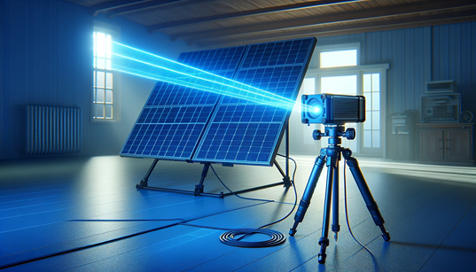
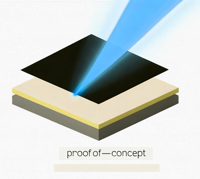

# Research Plan: BlueBeam Solar Labs Jerusalem 🌞🔬

## Objective 🎯
The primary objective of this research plan is to create a proof-of-concept for a new type of photovoltaic cell (solar panel) excited by short wavelength (blue) high power (7 watt) laser absorption. The research will be conducted at BlueBeam Solar Labs in Jerusalem. 🔋🔎

## Background 📜
Conventional solar panels rely on a broad spectrum of sunlight for energy conversion. This research aims to explore the potential of using high-power, short-wavelength laser light to excite photovoltaic cells, potentially leading to higher efficiency and novel applications. ☀️🌈

## Existing Knowledge 📚
Photovoltaic cells have varying efficiencies and absorption wavelengths. The tables below provide information on the efficiency and absorption wavelengths of different photovoltaic materials: 📊📈

### Table 1: Efficiency of Photovoltaic Materials 🌞📊
| Material          | Efficiency (%) | Notes                                             |
|-------------------|----------------|---------------------------------------------------|
| Silicon (Si)      | 20-25          | Most common commercial material                   |
| Cadmium Telluride (CdTe) | 15-20 | Good for thin-film applications                  |
| Copper Indium Gallium Selenide (CIGS) | 15-20 | High absorption coefficient                    |
| Perovskite        | 18-25          | Emerging material with rapid efficiency gains     |
| Gallium Arsenide (GaAs) | 25-30   | High efficiency; costly                           |

### Table 2: Absorption Wavelengths of Photovoltaic Materials 🌈📊
| Material          | Absorption Wavelength Range (nm) | Notes                                   |
|-------------------|----------------------------------|-----------------------------------------|
| Silicon (Si)      | 300-1100                         | Broad range                            |
| Cadmium Telluride (CdTe) | 400-800                | Good for short wavelengths             |
| Copper Indium Gallium Selenide (CIGS) | 500-1200  | Effective across a broad spectrum      |
| Perovskite        | 400-800                          | High absorption efficiency             |
| Gallium Arsenide (GaAs) | 400-900                    | High efficiency over a wide range      |

## Resources and Budget 💰🔬

The research plan will require the following resources:
- Advanced laser systems (7-watt blue laser) 🔦
- Photovoltaic materials and fabrication facilities 🌞🏭
- Characterization equipment (optical, electrical, structural) 🔬🔍
- Computational resources for theoretical modeling and data analysis 💻🧮
- Skilled research personnel (scientists, engineers, technicians) 👨‍🔬👩‍🔬👨‍💼

A detailed budget proposal will be prepared, considering the costs associated with equipment, materials, personnel, and other research-related expenses. 💰📝

## Expected Outcomes 📈🌞
The successful completion of this research plan is expected to yield the following outcomes:
- Proof-of-concept demonstration of a laser-excited photovoltaic cell with high efficiency and novel properties. 🔋🔬
- Fundamental understanding of the interaction between short-wavelength, high-power laser light and photovoltaic materials. 🌈🔍
- Identification of optimal materials, laser parameters, and cell architectures for enhanced performance. 🎛️📈
- Assessment of the scalability and potential applications of the technology. 📈🌍
- Publications in high-impact scientific journals and presentations at conferences. 📝🎤
- Collaboration opportunities with industry partners and research institutions for further development and commercialization. 🤝🏭

The research conducted at BlueBeam Solar Labs Jerusalem aims to push the boundaries of photovoltaic technology and explore innovative approaches to solar energy conversion. The success of this project could lead to the development of next-generation solar panels with improved efficiency, versatility, and cost-effectiveness. 🌞🔋💡

## Operation Principle 🔬🌈

The operation principle of the proposed photovoltaic cell rests on the quantum mechanical nature of electron transitions and the unique characteristics of high-power, short-wavelength laser excitation. Here's how these aspects come together to reveal untapped energy potential: 🌞🔦🔍

1. **Quantum Mechanical Electron Transitions:** 🔍⚛️
   - Photovoltaic cells convert photons into electricity by exciting electrons from the valence band to the conduction band of a semiconductor, creating electron-hole pairs. 🌞⚡
   - Short-wavelength laser light provides photons with higher energy due to their shorter wavelengths. This energy can induce quantum mechanical transitions that result in the excitation of electrons more efficiently than conventional sunlight. 🔦🌈

2. **Band Gap Optimization:** 🎛️🔍
   - Every semiconductor material has a specific band gap, the energy difference between the valence and conduction bands. The absorption of a photon excites an electron only if the photon's energy is at least as large as the band gap. 🔍🌈
   - Many conventional solar cells are designed for the broad spectrum of sunlight, where much energy is lost as heat. Short-wavelength lasers, however, can be tuned to match the optimal absorption wavelength of a specific material, ensuring maximum efficiency by reducing energy loss. 🔦🎛️

3. **Multiphoton Excitation:** 🔦🔍
   - High-power laser excitation allows for multiphoton absorption processes, where two or more low-energy photons combine to excite an electron across the band gap. 🔦🔍
   - This process unlocks additional energy levels that conventional solar panels cannot utilize, revealing previously untapped energy potential. 🔓🌞

4. **Hot Carrier Extraction:** 🔥🔍
   - When high-energy (hot) carriers are generated, they typically lose energy through heat dissipation before contributing to electrical power. 🔥⚡
   - BlueBeam's approach aims to harness these hot carriers before they relax to lower energy states, increasing the overall conversion efficiency. Laser excitation can deliver the precise energy required to sustain high-energy states long enough for extraction. 🔦🔍

5. **Research Proof-of-Concept:** 🔬🔍
   - This research will attempt to demonstrate how these quantum mechanical phenomena can be harnessed to drastically improve photovoltaic efficiency. 🔬🌞
   - By optimizing laser parameters (such as wavelength and power density) and matching them to a suitable semiconductor material, the study aims to uncover the energy potential of hot carriers, multiphoton excitation, and band gap tuning. 🔦🎛️🔍

In essence, current solar panels miss out on significant energy potential due to inherent losses in broad-spectrum absorption and band gap mismatches. By exploiting these quantum mechanical processes through optimized short-wavelength laser excitation, the proposed photovoltaic cells could revolutionize solar energy conversion efficiency and tap into untapped reserves of photonic energy. 🌞🔋💡
